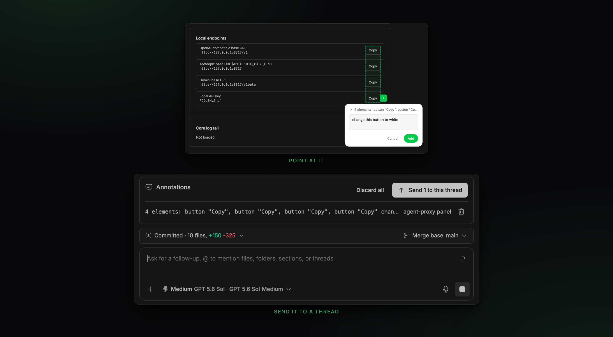

<div align="center">

<picture>
  <source media="(prefers-color-scheme: dark)" srcset="assets/logo-dark.svg" />
  
</picture>

# Agentation

**Point at the problem instead of describing it.**


</div>

<picture></picture>

Agentation puts a visual feedback toolbar over the whole bb interface — the app
shell and any surface another plugin drew. Click an element, write what should
change, and the annotation records the DOM selector, the React component path,
the bb route, and the plugin that owns the element. An agent reads that, fixes
the code, and resolves the annotation. The marker disappears from every open bb
window.

It is built on [Agentation](https://www.agentation.com) and its
[AFS 1.1](https://www.agentation.com/schema) annotation format. Agent tools are
registered natively, so there is no MCP server to run and nothing to configure
per agent. The toolbar talks to bb's own origin, so annotating through
`bb connect` works the same as annotating in the desktop app.

## What you get

| Surface | What it does |
|---|---|
| Toolbar | Mounts over the whole bb app, on every route. |
| Prompt action | Shows the live staged count and adds the batch as a mention. |
| `agentation_*` agent tools | Nine tools for the read → fix → resolve loop. |
| `bb agentation` | The same operations from a shell. |
| `agentation` skill | Teaches agents the loop. |

## Install

Install the independently versioned plugin from this monorepo:

```sh
git clone https://github.com/phosphorco/bb-community-plugins.git
cd bb-community-plugins
npm install
npm run build --workspace @phosphor/bb-plugin-agentation
bb plugin install path:. --plugin agentation
```

For a managed Git install, use the BB Community marketplace or the direct
command in the repository root README.

The toolbar appears in the bottom-right corner of bb. There is nothing else to
set up.

## Usage

**1. Point at it** — click the toolbar in the bottom-right corner of bb, then click
any element, including a plugin's own surface. Select several to annotate them
together, write what should change, and press **Add**.

**2. Attach it to a prompt** — the annotation lands in a shared staging area.
The Agentation prompt action shows the live number waiting. Click it in the
thread that should own the work, add any instructions you want, and send or
queue the native prompt normally. The mention loads current annotation content
when submitted; deleting it from the draft leaves the feedback staged.

When Identity Boundaries is installed and the browser request has a Tailscale
profile, Agentation records that profile id with newly created feedback. On
delivery it resolves the current profile through the identity plugin and wraps
that author's annotations in the same `[from=<tag>] ... [/from=<tag>]` frame
used by ordinary prompts. Feedback remains deliverable without the identity
plugin; it is simply left unattributed.

Use the row action to discard one staged annotation, or **Discard all** to
discard the batch shown, after confirmation. The CLI can re-stage discarded
feedback when recovery is necessary.

### What an annotation records

On top of the AFS fields, each annotation carries bb context, so an agent knows
where to look before it starts grepping.

| Field | Meaning |
|---|---|
| `bb.route` | The bb route the annotation was taken on. |
| `bb.pluginId` | Owning plugin, or `null` for the bb app shell. |
| `bb.surface` | `navPanel`, `inline`, or `overlay`. |
| `bb.threadId` / `bb.projectId` | Source context resolved from the route. |

### Commands

```
bb agentation pending [--plugin <id>] [--json]   every open annotation
bb agentation staged [--json]                    annotations waiting for a thread
bb agentation send [--queue] <threadId> [annotationId…]
                                                  assign now or queue for later
bb agentation restage <annotationId>             return one to staging
bb agentation sessions                           annotated pages
bb agentation show <annotationId>                one annotation in full
bb agentation acknowledge <annotationId>         mark as seen
bb agentation resolve <annotationId> [summary…]  mark as fixed
bb agentation dismiss <annotationId> <reason…>   decline, with a reason
bb agentation reply <annotationId> <message…>    ask the human a question
bb agentation toolbar [on|off]                   show or hide the toolbar
```

## Configuration

| Setting | Purpose |
|---|---|
| Days to keep resolved annotations | Retention for the nightly prune. Default 7. |

Toolbar visibility is live state, not a setting. Toggle it with
`bb agentation toolbar on|off`.

When Agentation has no saved theme, it starts with the opposite of bb's resolved
theme: light on dark bb, dark on light bb. Agentation's own theme control then
saves your choice, and later bb theme changes do not replace it.

## Troubleshooting

**The toolbar is not there.** Run `bb agentation toolbar on`.

**An agent resolved an annotation but the marker is still on the page.** The
toolbar refreshes within about a second. While the annotation popup holds typed
text or the caret, the refresh waits, so that your draft is not lost. Finish or
close the note.

**An agent cannot find the feedback.** Staged annotations belong to no thread
yet. Send the batch to a thread, or tell the agent to call
`agentation_get_all_pending`, which reads across every page.

**Two panes attached the same batch.** Both mentions remain valid references.
Sending either prompt does not consume or reassign the annotations; resolving or
dismissing feedback through the agent tools remains authoritative.

## Develop from source

Install from source as shown under [Install](#install). Then run the watcher,
which rebuilds and reloads the plugin on every edit:

```sh
bb plugin dev plugins/agentation
npm run test --workspace @phosphor/bb-plugin-agentation
```

This plugin is derived from Scott Sunarto's Agentation plugin at upstream
revision `e092db69a10ae159aed208b13303b1764683e03c`. Its original MIT license
and complete third-party notices are retained in this directory.
