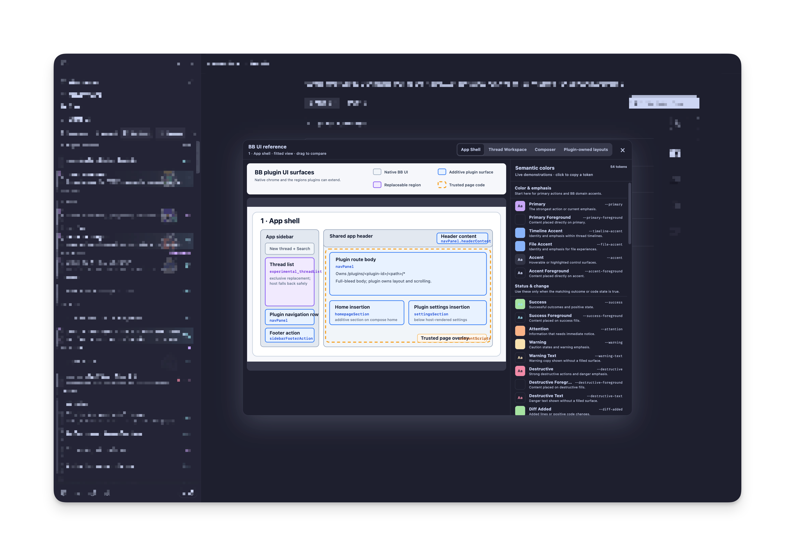

# BB UI Reference

BB UI Reference is a movable companion for comparing BB's UI surface map and
semantic palette with the real application. Click the question-mark button in the
**Footer action** surface to open or close it, then drag its title bar anywhere
in the window.



The frame contains:

- independently framed views of the researched BB plugin UI surface map, fitted
  without clipping, with its classification legend always visible;
- named tabs in the draggable title bar for jumping among its four sections;
- a compact, vertically scrollable list of every color in BB's public plugin
  theme bridge, grouped by purpose and explained with short usage guidance;
- visual demonstrations of fill, text, border, and focus-ring roles without
  exposing computed color values;
- click-to-copy semantic token names.

It does not inspect, classify, highlight, or intercept the real BB interface.
The image is bundled from `assets/bb-plugin-ui-surfaces.svg`; its matching trees
in `AGENTS.md` and the pinned SDK declarations remain the text-first contract.

## Develop

```sh
bb plugin install ./plugins/bb-ui-reference --yes
bb plugin dev ./plugins/bb-ui-reference
```

## Verify

```sh
npm run typecheck --workspace @phosphorco/bb-plugin-bb-ui-reference
npm run test --workspace @phosphorco/bb-plugin-bb-ui-reference
npm run build --workspace @phosphorco/bb-plugin-bb-ui-reference
```
