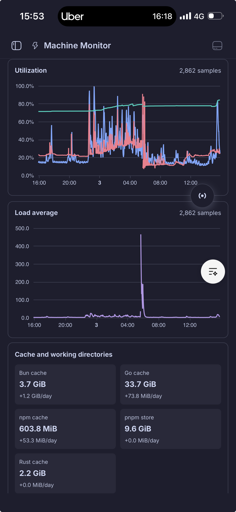
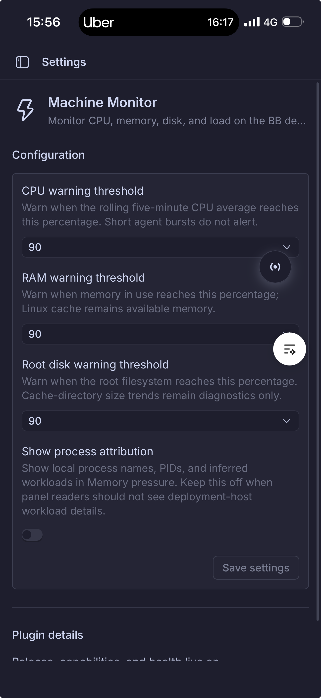

# Machine Monitor

Machine Monitor is a deliberately small BB community plugin that records CPU, memory, root-disk, and one-minute load average for the **machine running the BB server**. It also tracks the local Go, Rust, Bun, pnpm, and npm caches, `/tmp`, `~/.bb`, and BB worktrees. The root-disk breakdown is exclusive: when a measured folder has a measured child, it becomes `Other <folder>`; the derived `Other /` value reconciles the measured root-disk usage with all configured directories. Configure up to 32 additional absolute paths (one per line, with a 16 KiB total setting limit) in Plugin Settings; paths on another filesystem are displayed but do not affect root-disk Other. A destination that contains unreadable protected entries remains visible and is marked partial rather than disappearing. It does not query, enumerate, or report on other enrolled execution machines.

It samples CPU/RAM/root disk locally every 30 seconds and cache directories every 15 minutes, retains 30 days in the plugin SQLite database, and aggregates each requested range to no more than 720 ECharts points. A separate Linux memory diagnostic samples kernel pressure/reclaim counters every minute and increases only those lightweight measurements to five seconds while the kernel reports memory stalls. A bounded process ranking remains at once per minute, retaining seven days or at most 20,000 compact snapshots. The panel shows root disk and per-directory average growth per day over the selected history. It has no foreground polling: it refreshes only on an emitted local sample.

## Screenshots

| Mobile dashboard | Plugin settings |
| --- | --- |
|  |  |

## Warning thresholds

Configure CPU, RAM, and root-disk warnings in **Extensions → Plugins → Machine Monitor**. Each threshold offers 70%, 80%, 90%, or 95%.

- CPU alerts use a rolling five-minute average, so normal short-lived agent bursts do not turn the UI into an alarm.
- RAM is calculated from Linux `MemAvailable`, so reclaimable filesystem cache is not treated as pressure.
- Disk is the filesystem mounted at `/`; cache directories are shown as growth diagnostics but do not independently alert.
- Five-minute load average remains context only. It includes runnable work and I/O waits, and its healthy value depends on CPU count, so it is intentionally not a generic warning knob.

## Install

```sh
bb plugin install npm:@phosphorco/bb-plugin-machine-monitor@^0.1.0
```

Open **Machine Monitor** from the BB navigation sidebar. Its Activity icon stays neutral by default; a small warning dot appears only when CPU, RAM, or root-disk usage reaches its configured threshold, or when the collector has failed. Hover the dot for a concise overview. The Memory pressure section treats high RSS as context and labels thrash only from kernel pressure, reclaim/refault, swap, or major-fault evidence. Process names, PIDs, and inferred workload labels are neither stored nor shown by default because they can reveal deployment-host details; enable **Show process attribution** in plugin settings for an operator-only view. Process rankings use a bounded local scan of up to 2,048 processes, and should be read as a sampled ranking rather than a full process inventory. On Linux it reads `/proc/meminfo`, `/proc/stat`, `/proc/pressure/memory`, `/proc/vmstat`, and root filesystem statistics; unavailable metrics are shown as `—` rather than causing the collector to fail.

## Development

```sh
npm install
npm run test --workspace @phosphorco/bb-plugin-machine-monitor
npm run typecheck --workspace @phosphorco/bb-plugin-machine-monitor
npm run build --workspace @phosphorco/bb-plugin-machine-monitor
```
